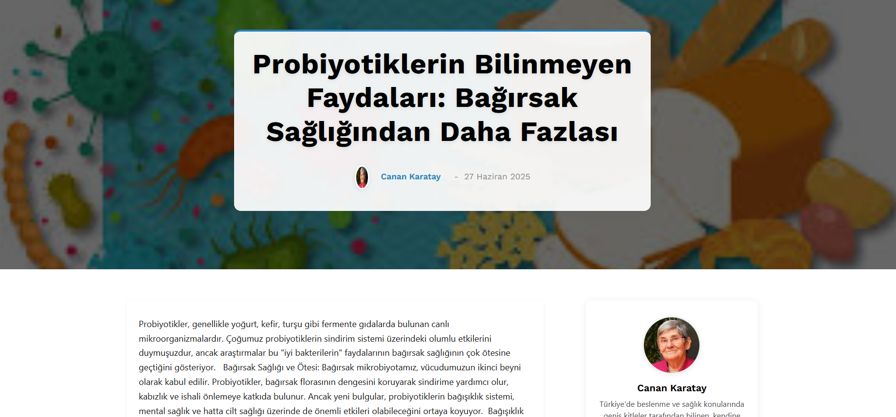
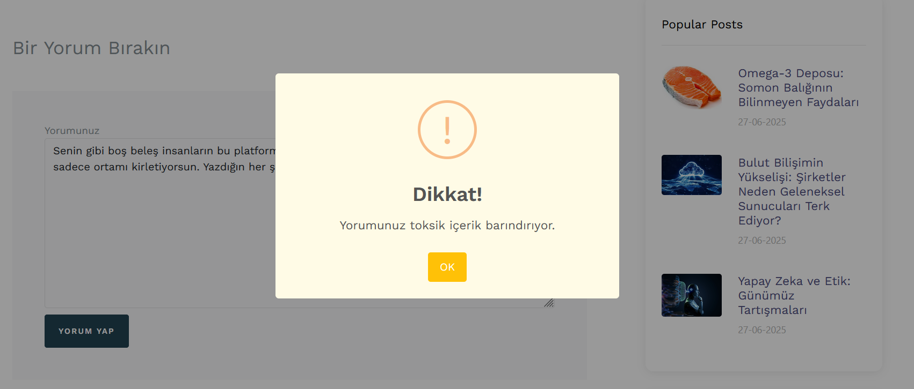
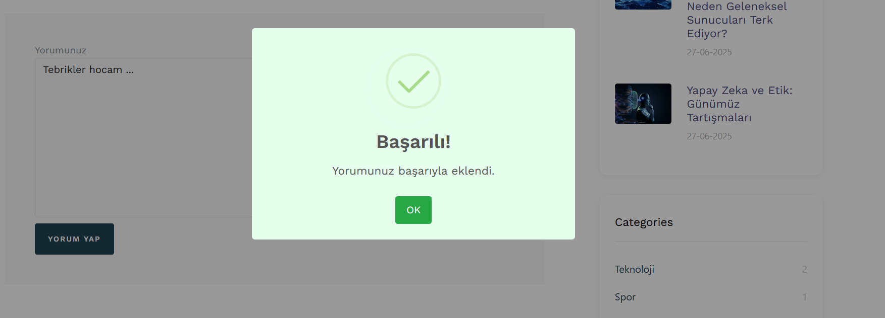
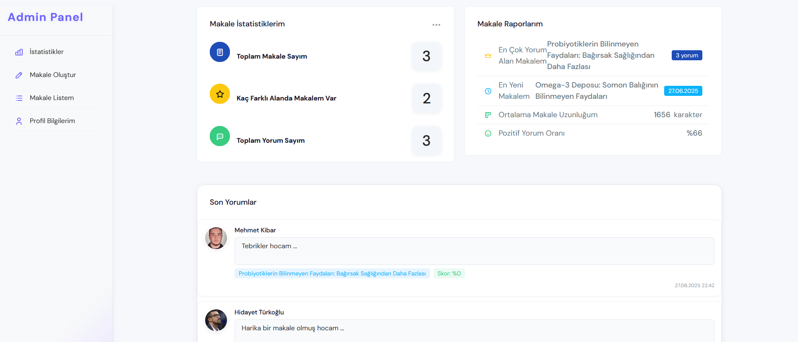
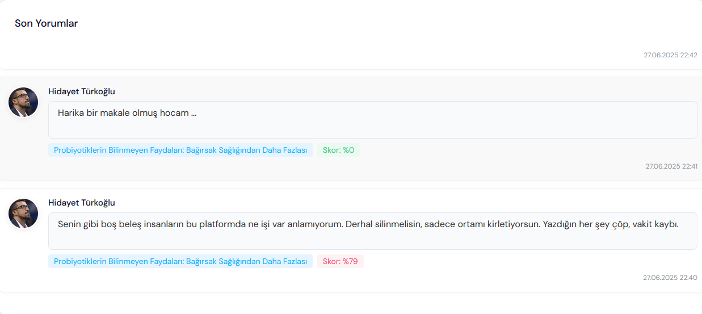
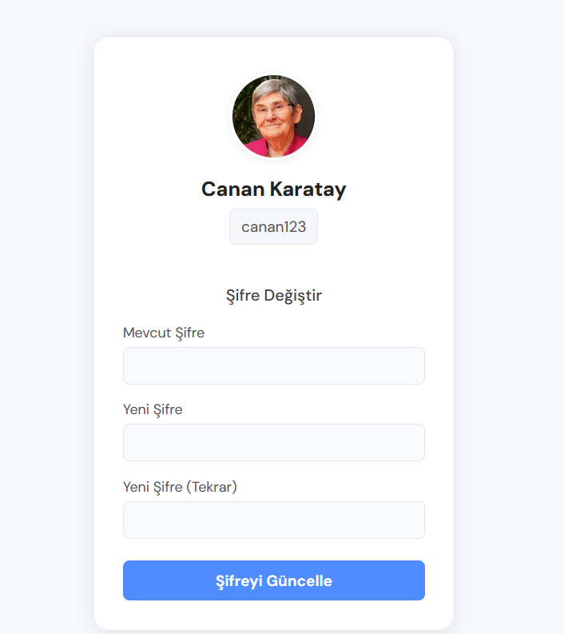

  
 
   
  <h1>✍️ BlogStore Akıllı Blog ve Yorum Sistemi 🧠</h1>
  
Yapay Zeka Destekli İçerik Yönetimi ve Güvenli Etkileşim

---

Bu proje, ASP.NET Core MVC mimarisi kullanılarak geliştirilmiş, makale yayınlama ve yorumlama özelliklerine sahip modern bir blog platformudur. Kullanıcıların etkileşimini artırmanın yanı sıra, yapay zeka destekli iki farklı dil modelini entegre ederek yorum güvenliğini ve çok dilliliği sağlamayı hedefler.

---

## ✨ Temel Özellikler

- **Makale Yönetimi:** Kullanıcılar (veya yöneticiler) makaleler oluşturabilir, düzenleyebilir ve yayınlayabilirler.
- **Akıllı Yorum Sistemi:**
    - ⚠️ **Toksik Yorum Algılama:** Hugging Face'in `ToxicBERT` modeli ile yorumlardaki potansiyel toksik içeriklerin otomatik tespiti ve moderasyonu.
    - 🌐 **Yorum Çeviri Özelliği:** Hugging Face'in `Helsinki-NLP/opus-mt-tr-en` modeli ile Türkçe yorumların İngilizce'ye çevrilmesi (API entegrasyonu).
- **Kullanıcı Yönetimi:** Kullanıcı kayıt, giriş ve profil yönetimi.
- **Kategori Yönetimi:** Makaleleri organize etmek için kategori oluşturma ve yönetimi.
- **Admin Paneli:** Makale, yorum, kullanıcı ve kategori yönetimi için merkezi bir arayüz ile kapsamlı istatistikler ve raporlama.
- **API Entegrasyonları:** Hugging Face Inference API ile güvenli API anahtarı tabanlı iletişim.
- **Component ve Partial View Mimarisi:** Tekrar kullanılabilir, modüler arayüz bileşenleri.
- **Service ve DTO (Data Transfer Object) Katmanları:** Temiz, test edilebilir ve sürdürülebilir bir kod tabanı için katmanlı mimari yaklaşımı.
- **Asenkron Veri İşlemleri:** Performanslı ve duyarlı kullanıcı deneyimi sunar.

---

## 🧠 Yapay Zeka Entegrasyonları (Dil Modelleri)

Bu projede, metin analizi ve işleme için iki farklı Hugging Face modeli entegre edilmiştir. Bu modeller, uygulamanın "akıllı" yeteneklerini oluşturur.

### ⚠️ Toksik Yorum Algılama (ToxicBERT)

- **Model:** Türkçe yorumlardaki toksik içeriği (nefret söylemi, taciz, kişisel saldırı vb.) tespit etmek üzere eğitilmiş, BERT tabanlı bir sınıflandırma modelidir. (`ToxicBERT` veya benzeri bir modelin API'si kullanılmıştır.)
- **Amaç:** Yorum bölümünde olumsuz ve zararlı içeriklerin yayılmasını önleyerek daha sağlıklı ve güvenli bir iletişim ortamı sağlamak.
- **İşleyiş:** Kullanıcı bir yorum gönderdiğinde, yorum metni gerçek zamanlı olarak bu modele bir API isteği ile gönderilir. Modelden dönen toksiklik skoru analiz edilerek, yorum otomatik olarak onay beklemeye alınır, işaretlenir veya doğrudan engellenir. Yöneticiler, toksik olarak işaretlenen yorumları gözden geçirebilir.

### 🌐 Yorum Çeviri (Helsinki-NLP/opus-mt-tr-en)

- **Model:** Türkçe (tr) metinleri İngilizce'ye (en) çevirmek için özel olarak eğitilmiş, NMT (Neural Machine Translation) tabanlı bir çeviri modelidir. (`Helsinki-NLP/opus-mt-tr-en` modeli kullanılmıştır.)
- **Amaç:**
    1.  Toksiklik algılama modelinin (eğer yalnızca İngilizce girdiyi daha iyi anlıyorsa) daha doğru çalışabilmesi için yorumları çevirmek.
    2.  İçeriği uluslararası kullanıcılara daha erişilebilir hale getirmek (ileriye dönük özellikler için potansiyel).
- **İşleyiş:** Belirli durumlarda (örneğin toksiklik analizi öncesi) Türkçe yorum metni bu çeviri modeline API isteği olarak gönderilir ve modelin sağladığı İngilizce çevirisi elde edilir. Bu çevrilmiş metin, sonraki analiz adımlarında kullanılabilir.

---

## ⚙️ Mimari Yapı

Proje, temiz kod prensipleri ve sürdürülebilirlik gözetilerek **Katmanlı Mimari (Layered Architecture)** prensiplerine uygun olarak tasarlanmıştır.

### 🔹 Katmanlar

- `BlogStore.WebUI` **(Presentation Layer):**
    - Kullanıcı arayüzü (ASP.NET Core MVC Razor Views) ve Controller'lar.
    - Kullanıcı isteklerini alır ve iş katmanına yönlendirir. ViewModel'lar aracılığıyla View'lere veri taşır.
- `BlogStore.BusinessLayer` **(Business Logic Layer):**
    - Uygulamanın iş kurallarını, servislerini (örn. `IArticleService`, `ICommentService`, `ITranslationService`, `IToxicityService`) ve iş operasyonlarını barındırır.
    - Bağımlılık Enjeksiyonu (DI) ile dış servisleri (API entegrasyonları, veritabanı servisleri) yönetir.
- `BlogStore.DataAccessLayer` **(Data Access Layer):**
    - Veritabanı ile tüm etkileşimi yönetir. CRUD (Create, Read, Update, Delete) operasyonlarını kapsüller.
    - Entity Framework Core gibi bir ORM aracı ile veritabanı işlemlerini kolaylaştırır.
- `BlogStore.EntityLayer` **(Entity Layer):**
    - Veritabanı tablolarına karşılık gelen saf varlık (entity) sınıflarını (örn. `Article`, `Comment`, `AppUser`, `Category`) içerir.
    - Veri modellerinin tanımlandığı katmandır.

### 🔹 Veri Yapısı ve İlişkiler

Projede, makaleler, yorumlar, kullanıcılar ve kategoriler gibi ana varlıklar arasında güçlü ilişkiler (örneğin bir makalenin birden çok yorumu olması, bir kullanıcının birden çok makale yazabilmesi) kurulmuştur. Bu ilişkiler, Entity Framework Core'un sağladığı navigasyon özellikleri, Foreign Key tanımlamaları ve fluent API yapılandırmaları ile etkin bir şekilde yönetilir.

---

## 💻 Kullanılan Teknolojiler

- **Backend:**
    - ASP.NET Core MVC 🌐
    - C# 10 🚀
    - Entity Framework Core (Veritabanı ORM) 📊
    - Microsoft Identity (Kullanıcı Kimlik Doğrulama ve Yetkilendirme) 🔑
    - LINQ, Async/Await (Veri sorgulama ve asenkron programlama) ✨
- **Frontend:**
    - HTML5, CSS3, JavaScript 💻
    - Bootstrap 5 (Duyarlı ve modern tasarım) 🎨
    - jQuery (AJAX işlemleri ve DOM manipülasyonu) ⚡
    - Razor Pages (Dinamik View oluşturma) 📄
- **API Entegrasyonları:**
    - Hugging Face Inference API (Yapay zeka modellerine erişim) 🧠
    - `HttpClient` sınıfı (Dış API çağrıları için) 📡
    - `Newtonsoft.Json` (JSON verilerini işlemek için) 📦
- **Veritabanı:**
    - [**SQL Server**] 💾

---

## 📸 Uygulama Görselleri

### 🏡 Anasayfa & Keşfet

| Anasayfa |  Makale |
|:----------:|:----------:|
|  |  |

### 📝 Yorum Sistemi

| Yorum Kontrol | Yorum Ekleme Alanı |
|:------------:|:-----------:|
|  |  |

### 🛡️ Yönetim Paneli

| İstatistikler | Son Yorumlar |Admin Panel | Yönetim | 
|:------------------------:|:---------------:|:---------------:|:------------:|
|  |  |  |  |  

---
